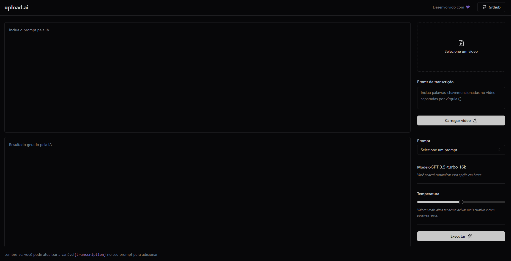
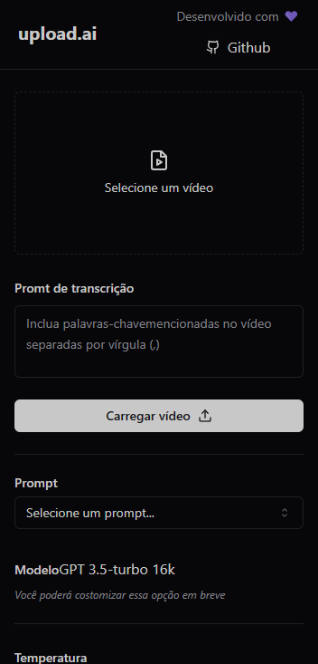

<h1 align='center'> Upload AI </h1>

 Projeto desenvolvido na Nlw-AI pela empresa <a href='https://www.rocketseat.com.br/'>Rocketseat</a> 

 

📃 Bem-vindo ao Upload AI, oferece uma solução poderosa para extrair informações valiosas de vídeos. Com uma integração da OpenAI, a plataforma permite que os utilizadores carreguem vídeos e obtenham transcrições do conteúdo falado nesses vídeos. Além disso, os utilizadores podem escolher um "prompt" que servirá de base para gerar automaticamente por exemplo: "Uma descrição do que foi falado no video", caso selecione o prompt para isso. Para finalizar o processo e obter o resultado aperte no botão logo abaixo em "Executar". O processo é simples e eficaz, ajudando a economizar tempo e recursos na análise de conteúdo audiovisual.

 

[😀=> Upload AI <=😀](https://nlw-ai-upload-web.vercel.app/)

<h2> 🛠 Tecnologias Principais Utilizadas </h2>

> Este projeto foi construído com uma pilha de tecnologias modernas e poderosas para fornecer uma experiência de usuário excepcional. Abaixo estão algumas das principais tecnologias e bibliotecas utilizadas no projeto:

- Vite
- React
- Tailwind CSS
- TypeScript
- OpenAI
- @ffmpeg/ffmpeg e @ffmpeg/util
- @radix-ui

<h3> Autor </h3>

>Romeu soares de souto

<h2 align='center'> Meus contatos </h2>

>Se tiver alguma dúvida, sugestão ou feedback, sinta-se à vontade para entrar em contato:

* [LinkedIn](https://www.linkedin.com/in/romeu-soares-87749a231/)

* romeuindexjs@gmail.com

* WhatsApp: 84 981127596

 

<h3> Licença </h3>

